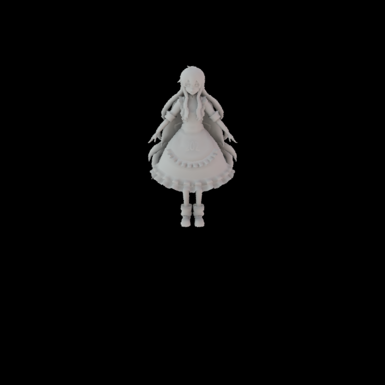
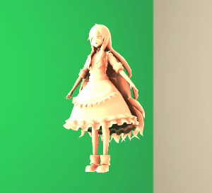

# GAMES202 Homework2

作者: 彭博

## 项目描述
本次作业使用PRT对环境光照进行渲染，主要内容包括:

- 预计算环境光照
- Diffuse Unshadowed LT
- Diffuse Shadowed LT
- Bonus 1: Diffuse Inter-reflection
- PRT材质
- Bonus 2: SH 旋转

## 预计算环境光照

首先是对环境光照进行预计算，这里需要将环境光照投影到相应的球谐函数上得到对应的球谐系数向量，即:

$$SH_{coeff} = \int L_{env}(\omega_i) SH(\omega_i) d \omega_i$$

本次作业使用黎曼积分来进行计算，代码可参见`prt.cpp`文件中`PrecomputeCubemapSH`函数。核心代码摘录如下:

```cpp
Eigen::Vector3f dir = cubemapDirs[i * width * height + y * width + x];
int index = (y * width + x) * channel;
Eigen::Array3f Le(images[i][index + 0], images[i][index + 1],
                  images[i][index + 2]);

sumWeight = CalcArea((float)x, (float)y, width, height);

for (int l = 0; l < SHOrder+1; l++) {
    for (int m = -l; m < l+1; m++) {
        double sh = sh::EvalSH(l, m, dir.cast<double>());

        int idx = sh::GetIndex(l, m);
        SHCoeffiecents[idx] += Le * (float)sh * sumWeight;
    }
}
```

这里首先计算了cubemap上给定坐标$(x, y)$投影到球面对应的面积，然后针对每一个球谐函数计算了给定方向的函数值，并最终与环境光相乘累加得到最终所需的球谐系数向量。

## Diffuse Unshadowed LT

完成预计算环境光照后需要对传输项进行预计算。对于Diffuse Unshadowed的情况只需考虑几何项$\max(N_x \omega_i, 0)$投影到各个球谐函数上对应的系数，即：

$$L_{DU} = \int_\Omega \max(N_x \cdot \omega_i, 0) d \omega_i$$

注：这里暂时忽略了BRDF带来的$\frac{\rho}{\pi}$，在输出时会额外把这项添加进来

与环境光预计算不同，这里使用了蒙特卡洛积分来进行计算并通过调用`sh::ProjectFunction`函数来完成计算。此处的核心代码是完成给定方向$(\phi, \theta)$计算$\max(N_x \cdot \omega_i, 0)$的函数：

```cpp
Eigen::Array3d d = sh::ToVector(phi, theta);
const auto wi = Vector3f(d.x(), d.y(), d.z());
if (m_Type == Type::Unshadowed)
{
    // TODO: here you need to calculate unshadowed transport term of a given direction
    // TODO: 此处你需要计算给定方向下的unshadowed传输项球谐函数值
    double Ldu = n.dot(wi);
    return Ldu>0.0?Ldu:0.0;
}
```

补充完代码后在`scenes/prt.xml`文件中将`type`类型设置为`unshadowed`，调用`./nori.exe scenes/prt.xml`即可获得模型图片如下:

<div align=center>

</div>

## Diffuse Shadowed LT

Diffuse Shadowed的情况与Diffuse Unshadowed类似，只不过需要额外添加可见项$V(\omega_i)$:

$$L_{DS} = \int_\Omega \max(N_x \cdot \omega_i, 0) V(\omega_i) d \omega_i$$

因此只需要将求值函数`shFunc`修改如下:

```cpp
Eigen::Array3d d = sh::ToVector(phi, theta);
const auto wi = Vector3f(d.x(), d.y(), d.z());
if (m_Type == Type::Unshadowed)
{
    // TODO: here you need to calculate unshadowed transport term of a given direction
    // TODO: 此处你需要计算给定方向下的unshadowed传输项球谐函数值
    double Ldu = n.dot(wi);
    return Ldu>0.0?Ldu:0.0;
}
else
{
    // TODO: here you need to calculate shadowed transport term of a given direction
    // TODO: 此处你需要计算给定方向下的shadowed传输项球谐函数值
    double Lds = n.dot(wi);
    if (Lds > 0.0) {
        Ray3f ray(v, wi);

        return scene->rayIntersect(ray)?0.0:Lds;
    }

    return 0.0;
}
```

补充完代码后在`scenes/prt.xml`文件中将`type`类型设置为`shadowed`，调用`./nori.exe scenes/prt.xml`即可获得模型图片如下:

<div align=center>

</div>

## Bonus 1: Diffuse Inter-reflection

对于具有相互反射的情况需要进行迭代求解。第$n$次反射对应的球谐系数为:

$$L_{DI}^n = \int_\Omega L_{DI}^{n-1} \max(N_x \cdot \omega_i, 0) (1-V(\omega_i)) d \omega_i$$

其中$L_{DI}^{n-1}$为上一次反射对应的球谐系数，且$L_{DI}^0$即为Diffuse Shadowed情况下的系数。这里使用了与之前计算运输项类似的方式，即通过调用`sh::ProjectFunction`函数来完成计算，相应的求值函数`shFunc`定义如下：

```cpp
Eigen::Array3d d = sh::ToVector(phi, theta);
const auto wi = Vector3f(d.x(), d.y(), d.z());

double Ldi = n.dot(wi);
if (Ldi > 0.0) {
    Ray3f ray(v, wi);
    Intersection its;

    if (scene->rayIntersect(ray, its)) {
        Eigen::VectorXf shCoeff_DI = Eigen::VectorXf(SHCoeffLength).setZero();

        // interpolate shCoeff
        for (int j = 0; j < 3; j++) {
            int idx = its.tri_index[j];
            float bary = its.bary[j];

            shCoeff_DI += m_TransportSHCoeffs_DI_prev.col(idx) * bary;
        }

        // reconstruct light
        double L = 0.0;
        for (int l = 0; l < SHOrder+1; l++) {
            for (int m = -l; m < l+1; m++) {
                double sh = sh::EvalSH(l, m, phi, theta);

                int idx = sh::GetIndex(l, m);
                L += sh * shCoeff_DI[idx];
            }
        }

        return L * Ldi;
    }
}

return 0.0;
```

对于给定方向$(\phi, \theta)$，首先从顶点$v$发出射线并判断射线与模型是否相交。在相交的情况下利用重心坐标对交点上一次反射对应的球谐系数进行插值，并利用相应的球谐函数重建间接光照。最后将几何项$\max(N_x \cdot \omega_i, 0)$、可见项$V(\omega_i)$以及光照项$L_{DI}^{n-1}$相乘得到最终的值。

补充完代码后在`scenes/prt.xml`文件中将`type`类型设置为`interreflection`，调用`./nori.exe scenes/prt.xml`即可获得光线进行一次弹射的模型图片如下。对比Shadowed情况，可以明显发现考虑光线弹射后模型整体（尤其是头部和裙子）变亮了。

<div align=center>

</div>

## PRT材质

完成预计算环境光照和光线运输后回到WebGL框架进行渲染。首先需要定义PRT材质，在`./src/materials`内新建材质`PRTMaterial.js`:

```js
class PRTMaterial extends Material {
    constructor(vertexShader, fragmentShader) {

        let colorMat3 = getMat3ValueFromRGB(precomputeL[guiParams.envmapId]);

        let precomputeLR = colorMat3[0];
        let precomputeLG = colorMat3[1];
        let precomputeLB = colorMat3[2];

        super({
            'uPrecomputeLR': { type: 'precomputeL', value: precomputeLR },
            'uPrecomputeLG': { type: 'precomputeL', value: precomputeLG },
            'uPrecomputeLB': { type: 'precomputeL', value: precomputeLB },
        
        }, ['aPrecomputeLT'], vertexShader, fragmentShader, null);
    }

}

async function buildPRTMaterial(vertexPath, fragmentPath) {

    let vertexShader = await getShaderString(vertexPath);
    let fragmentShader = await getShaderString(fragmentPath);

    return new PRTMaterial(vertexShader, fragmentShader);

}
```

这里PRT材质包括3个通道的环境光项`uPrecomputeLR`、`uPrecomputeLG`和`uPrecomputeLB`，以及顶点的光线运输项`aPrecomputeLT`。然后定义材质所需的shader，在`./src/shaders`中新建文件夹`prtShader`并添加shader文件`prtVertex.glsl`以及`prtFragment.glsl`。其中顶点着色器`prtVertex.glsl`定义为:

```glsl
void main(void) {

    vFragPos = (uModelMatrix * vec4(aVertexPosition, 1.0)).xyz;
    vNormal = (uModelMatrix * vec4(aNormalPosition, 0.0)).xyz;

    gl_Position = uProjectionMatrix * uViewMatrix * uModelMatrix *
                  vec4(aVertexPosition, 1.0);

    vColor = vec3(cwiseProdSum(uPrecomputeLR, aPrecomputeLT),
                  cwiseProdSum(uPrecomputeLG, aPrecomputeLT),
                  cwiseProdSum(uPrecomputeLB, aPrecomputeLT)
                  );
}
```

顶点着色器首先计算顶点的位置，然后将顶点颜色记录到`vColor`中。其中RGB各个通道的颜色为环境光与光线运输对应球谐系数的乘积并求和。然后是片元着色器`prtFragment.glsl`:

```glsl
void main(void) {
    gl_FragColor = vec4(vColor, 1.0);
}
```

片元着色器比较简单，只需将`vColor`转换为颜色输出的格式即可。最后运行框架即可获得环境光照下的模型渲染如下图所示，其他环境光下的渲染结果可参见`./images`。

<div align=center>

</div>

## Bonus 2: SH 旋转

利用球谐函数的旋转性质可以实现旋转光源情况下的实时渲染。具体地，对于任意band下的球谐系数其旋转前后只相差一个线性变换，且不同band间的系数互不影响。因此可以使用一个矩阵$M$来描述球谐系数的变换:

$$ M P(n) = P(R(n)) $$

其中，$P(n)$为某一band下旋转前的球谐系数，$P(R(n))$为旋转后的系数。因此对于第$l$阶的球谐系数只需要选取$2l+1$个方向进行旋转并构造求解线性方程组即可。以$l=1$为例，计算求解$M$矩阵的代码可参见`./src/utils/tools.js`中`computeSquareMatrix_3by3`函数：

```js
function computeSquareMatrix_3by3(rotationMatrix){ // 计算方阵SA(-1) 3*3 
	
	// 1、pick ni - {ni}
	let n1 = [1, 0, 0, 0]; let n2 = [0, 0, 1, 0]; let n3 = [0, 1, 0, 0];

	// 2、{P(ni)} - A  A_inverse
	let N = math.zeros(3, 3);
	for (let i = 0; i < 3; i++) {
		N.subset(math.index(i, 0), n1[i]);
		N.subset(math.index(i, 1), n2[i]);
		N.subset(math.index(i, 2), n3[i]);
	}

	// project vector to SH
	let P1 = SHEval(n1[0], n1[1], n1[2], 3);
	let P2 = SHEval(n2[0], n2[1], n2[2], 3);
	let P3 = SHEval(n3[0], n3[1], n3[2], 3);

	let A = math.zeros(3, 3);
	for (let i = 0; i < 3; i++) {
		A.subset(math.index(i, 0), P1[i+1]);
		A.subset(math.index(i, 1), P2[i+1]);
		A.subset(math.index(i, 2), P3[i+1]);
	}

	let A_inv = math.inv(A);

	// 3、用 R 旋转 ni - {R(ni)}
	let R = mat4Matrix2mathMatrix(rotationMatrix);
	R = R.subset(math.index(math.range(0, 3), math.range(0, 3)));

	let Rn= math.multiply(math.transpose(R), N);

	// 4、R(ni) SH投影 - S
	// project rotated vector to SH
	let PR1 = SHEval(Rn.subset(math.index(0, 0)), Rn.subset(math.index(1, 0)), Rn.subset(math.index(2, 0)), 3);
	let PR2 = SHEval(Rn.subset(math.index(0, 1)), Rn.subset(math.index(1, 1)), Rn.subset(math.index(2, 1)), 3);
	let PR3 = SHEval(Rn.subset(math.index(0, 2)), Rn.subset(math.index(1, 2)), Rn.subset(math.index(2, 2)), 3);

	let S = math.zeros(3, 3);
	for (let i = 0; i < 3; i++) {
		S.subset(math.index(i, 0), PR1[i+1]);
		S.subset(math.index(i, 1), PR2[i+1]);
		S.subset(math.index(i, 2), PR3[i+1]);
	}

	// 5、S*A_inverse
	let M = math.multiply(S, A_inv);

	return M;
}
```

类似地，完成$l=2$时计算$M$矩阵的函数`computeSquareMatrix_5by5`。然后即可实现对环境光球谐系数的旋转函数`getRotationPrecomputeL`:

```js
function getRotationPrecomputeL(precompute_L, rotationMatrix){
	let result = [];

	let M = math.identity(9);

	// 3 by 3
	let M3 = computeSquareMatrix_3by3(rotationMatrix);
	M.subset(math.index(math.range(1, 4), math.range(1, 4)), M3);

	// 5 by 5
	let M5 = computeSquareMatrix_5by5(rotationMatrix);
	M.subset(math.index(math.range(4, 9), math.range(4, 9)), M5);

	for(var i = 0; i<3; i++) {
		let L = [precompute_L[0][i], precompute_L[1][i], precompute_L[2][i],
				 precompute_L[3][i], precompute_L[4][i], precompute_L[5][i],
				 precompute_L[6][i], precompute_L[7][i], precompute_L[8][i]];
		
		let vecL = math.matrix(L);

		let ML = math.multiply(M, vecL);
		ML = ML.reshape([9]);
		
		result[i] = [ML.subset(math.index(0)), ML.subset(math.index(1)), ML.subset(math.index(2)),
					ML.subset(math.index(3)), ML.subset(math.index(4)), ML.subset(math.index(5)),
					ML.subset(math.index(6)), ML.subset(math.index(7)), ML.subset(math.index(8)),];
	}

	return result;
}
```

最后在`./src/renderers/WebGLRenderer.js`中添加更新环境光的代码:

```js
// Bonus - Fast Spherical Harmonic Rotation
let precomputeL_RGBMat3 = getRotationPrecomputeL(precomputeL[guiParams.envmapId], cameraModelMatrix);

if (k == 'uPrecomputeLR') {
    let precomputeLR = mat3.fromValues(precomputeL_RGBMat3[0][0], precomputeL_RGBMat3[0][1], precomputeL_RGBMat3[0][2],
                                        precomputeL_RGBMat3[0][3], precomputeL_RGBMat3[0][4], precomputeL_RGBMat3[0][5],
                                        precomputeL_RGBMat3[0][6], precomputeL_RGBMat3[0][7], precomputeL_RGBMat3[0][8]);

    gl.uniformMatrix3fv(
        this.meshes[i].shader.program.uniforms[k],
        false,
        precomputeLR);
    }

if (k == 'uPrecomputeLG') {
    let precomputeLG = mat3.fromValues(precomputeL_RGBMat3[1][0], precomputeL_RGBMat3[1][1], precomputeL_RGBMat3[1][2],
                                        precomputeL_RGBMat3[1][3], precomputeL_RGBMat3[1][4], precomputeL_RGBMat3[1][5],
                                        precomputeL_RGBMat3[1][6], precomputeL_RGBMat3[1][7], precomputeL_RGBMat3[1][8]);

    gl.uniformMatrix3fv(
        this.meshes[i].shader.program.uniforms[k],
        false,
        precomputeLG);
    }

if (k == 'uPrecomputeLB') {
    let precomputeLB = mat3.fromValues(precomputeL_RGBMat3[2][0], precomputeL_RGBMat3[2][1], precomputeL_RGBMat3[2][2],
                                        precomputeL_RGBMat3[2][3], precomputeL_RGBMat3[2][4], precomputeL_RGBMat3[2][5],
                                        precomputeL_RGBMat3[2][6], precomputeL_RGBMat3[2][7], precomputeL_RGBMat3[2][8]);

    gl.uniformMatrix3fv(
        this.meshes[i].shader.program.uniforms[k],
        false,
        precomputeLB);
    }
```

开启环境光旋转后进行录制得到动画如下：

<div align=center>


</div>

## Reference

* [Precomputation-Based Rendering](https://cseweb.ucsd.edu/~ravir/prtsurvey.pdf)
* [A Gentle Introduction to Precomputed Radiance Transfer](https://www.inf.ufrgs.br/~oliveira/pubs_files/Slomp_Oliveira_Patricio-Tutorial-PRT.pdf)
* [Spherical Harmonic Lighting: The Gritty Details](http://www.cse.chalmers.se/~uffe/xjobb/Readings/GlobalIllumination/Spherical%20Harmonic%20Lighting%20-%20the%20gritty%20details.pdf)