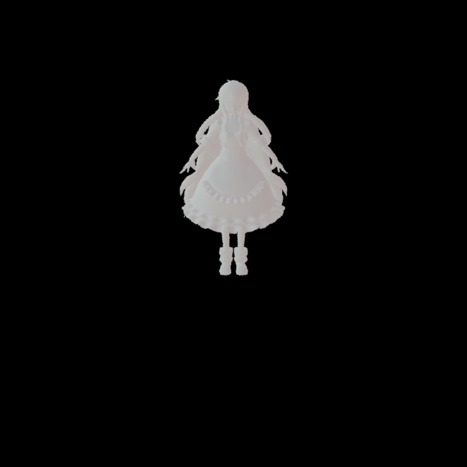
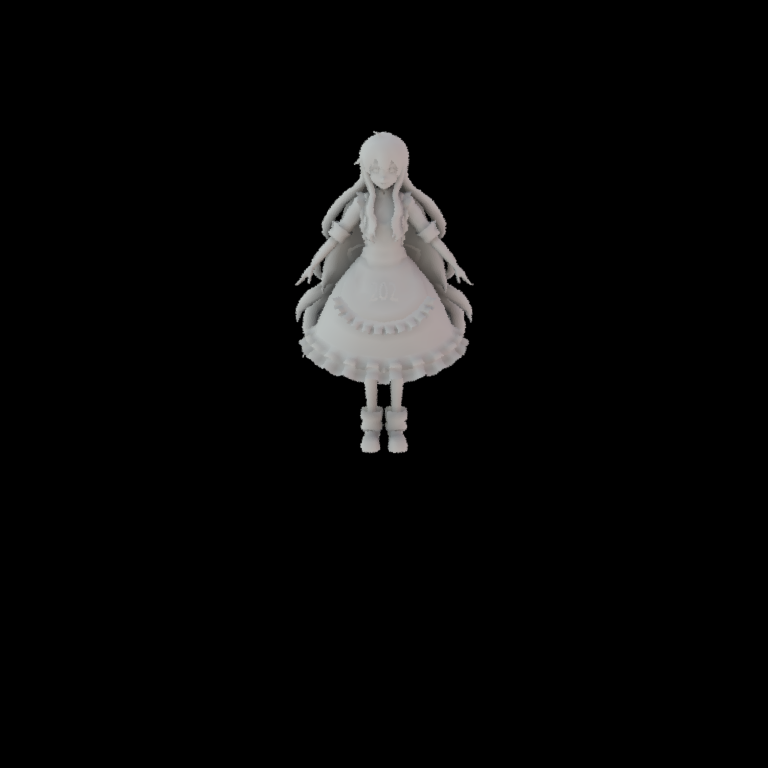

# GAMES202 Homework2

作者: 彭博

## 项目描述
本次作业使用PRT对环境光照进行渲染，主要内容包括:

- 预计算环境光照
- Diffuse Unshadowed LT
- Diffuse Shadowed LT
- Bonus 1: Diffuse Inter-reflection
- PRT材质
- Bonus 2: SH 旋转

## 预计算环境光照

首先是对环境光照进行预计算，这里需要将环境光照投影到相应的球谐函数上得到对应的球谐系数向量，即:

$$SH_{coeff} = \int L_{env}(\omega_i) SH(\omega_i) d \omega_i$$

本次作业使用黎曼积分来进行计算，代码可参见`prt.cpp`文件中`PrecomputeCubemapSH`函数。核心代码摘录如下:

```cpp
Eigen::Vector3f dir = cubemapDirs[i * width * height + y * width + x];
int index = (y * width + x) * channel;
Eigen::Array3f Le(images[i][index + 0], images[i][index + 1],
                  images[i][index + 2]);

sumWeight = CalcArea((float)x, (float)y, width, height);

for (int l = 0; l < SHOrder+1; l++) {
    for (int m = -l; m < l+1; m++) {
        double sh = sh::EvalSH(l, m, dir.cast<double>());

        int idx = sh::GetIndex(l, m);
        SHCoeffiecents[idx] += Le * (float)sh * sumWeight;
    }
}
```

这里首先计算了cubemap上给定坐标$(x, y)$投影到球面对应的面积，然后针对每一个球谐函数计算了给定方向的函数值，并最终与环境光相乘累加得到最终所需的球谐系数向量。

## Diffuse Unshadowed LT

完成预计算环境光照后需要对传输项进行预计算。对于Diffuse Unshadowed的情况只需考虑几何项$\max(N_x \omega_i, 0)$投影到各个球谐函数上对应的系数，即：

$$L_{DU} = \int_\Omega \max(N_x \cdot \omega_i, 0) d \omega_i$$

注：这里暂时忽略了BRDF带来的$\frac{\rho}{\pi}$，在输出时会额外把这项添加进来

与环境光预计算不同，这里使用了蒙特卡洛积分来进行计算并通过调用`sh::ProjectFunction`函数来完成计算。此处的核心代码是完成给定方向$(\phi, \theta)$计算$\max(N_x \cdot \omega_i, 0)$的函数：

```cpp
Eigen::Array3d d = sh::ToVector(phi, theta);
const auto wi = Vector3f(d.x(), d.y(), d.z());
if (m_Type == Type::Unshadowed)
{
    // TODO: here you need to calculate unshadowed transport term of a given direction
    // TODO: 此处你需要计算给定方向下的unshadowed传输项球谐函数值
    double Ldu = n.dot(wi);
    return Ldu>0.0?Ldu:0.0;
}
```

补充完代码后在`scenes/prt.xml`文件中将`type`类型设置为`unshadowed`，调用`./nori.exe scenes/prt.xml`即可获得模型图片如下:

<div align=center>

</div>

## Diffuse Shadowed LT

Diffuse Shadowed的情况与Diffuse Unshadowed类似，只不过需要额外添加可见项$V(\omega_i)$:

$$L_{DS} = \int_\Omega \max(N_x \cdot \omega_i, 0) V(\omega_i) d \omega_i$$

因此只需要将求值函数`shFunc`修改如下:

```cpp
Eigen::Array3d d = sh::ToVector(phi, theta);
const auto wi = Vector3f(d.x(), d.y(), d.z());
if (m_Type == Type::Unshadowed)
{
    // TODO: here you need to calculate unshadowed transport term of a given direction
    // TODO: 此处你需要计算给定方向下的unshadowed传输项球谐函数值
    double Ldu = n.dot(wi);
    return Ldu>0.0?Ldu:0.0;
}
else
{
    // TODO: here you need to calculate shadowed transport term of a given direction
    // TODO: 此处你需要计算给定方向下的shadowed传输项球谐函数值
    double Lds = n.dot(wi);
    if (Lds > 0.0) {
        Ray3f ray(v, wi);

        return scene->rayIntersect(ray)?0.0:Lds;
    }

    return 0.0;
}
```

补充完代码后在`scenes/prt.xml`文件中将`type`类型设置为`shadowed`，调用`./nori.exe scenes/prt.xml`即可获得模型图片如下:

<div align=center>

</div>

## Bonus 1: Diffuse Inter-reflection

对于具有相互反射的情况需要进行迭代求解。第$n$次反射对应的球谐系数为:

$$L_{DI}^n = \int_\Omega L_{DI}^{n-1} \max(N_x \cdot \omega_i, 0) (1-V(\omega_i)) d \omega_i$$

其中$L_{DI}^{n-1}$为上一次反射对应的球谐系数，且$L_{DI}^0$即为Diffuse Shadowed情况下的系数。这里使用了与之前计算运输项类似的方式，即通过调用`sh::ProjectFunction`函数来完成计算，相应的求值函数`shFunc`定义如下：

```cpp
Eigen::Array3d d = sh::ToVector(phi, theta);
const auto wi = Vector3f(d.x(), d.y(), d.z());

double Ldi = n.dot(wi);
if (Ldi > 0.0) {
    Ray3f ray(v, wi);
    Intersection its;

    if (scene->rayIntersect(ray, its)) {
        Eigen::VectorXf shCoeff_DI = Eigen::VectorXf(SHCoeffLength).setZero();

        // interpolate shCoeff
        for (int j = 0; j < 3; j++) {
            int idx = its.tri_index[j];
            float bary = its.bary[j];

            shCoeff_DI += m_TransportSHCoeffs_DI_prev.col(idx) * bary;
        }

        // reconstruct light
        double L = 0.0;
        for (int l = 0; l < SHOrder+1; l++) {
            for (int m = -l; m < l+1; m++) {
                double sh = sh::EvalSH(l, m, phi, theta);

                int idx = sh::GetIndex(l, m);
                L += sh * shCoeff_DI[idx];
            }
        }

        return L * Ldi;
    }
}

return 0.0;
```

对于给定方向$(\phi, \theta)$，首先从顶点$v$发出射线并判断射线与模型是否相交。在相交的情况下利用重心坐标对交点上一次反射对应的球谐系数进行插值，并利用相应的球谐函数重建间接光照。最后将几何项$\max(N_x \cdot \omega_i, 0)$、可见项$V(\omega_i)$以及光照项$L_{DI}^{n-1}$相乘得到最终的值。

补充完代码后在`scenes/prt.xml`文件中将`type`类型设置为`interreflection`，调用`./nori.exe scenes/prt.xml`即可获得光线进行一次弹射的模型图片如下。对比Shadowed情况，可以明显发现考虑光线弹射后模型整体（尤其是头部和裙子）变亮了。

<div align=center>

</div>

## PRT材质

## Bonus 2: SH 旋转

## Reference