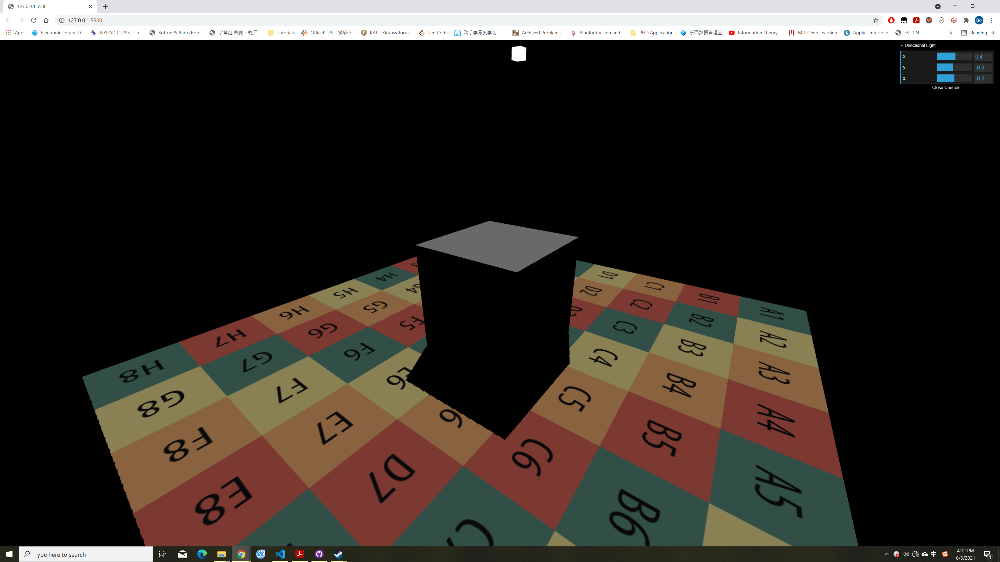
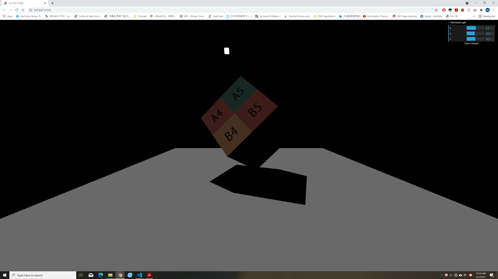
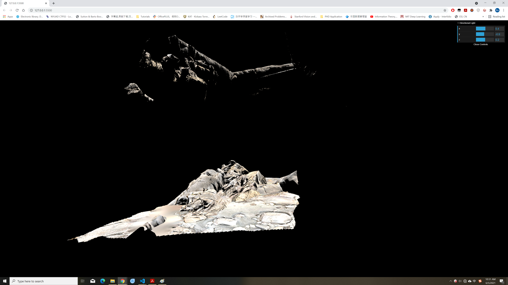
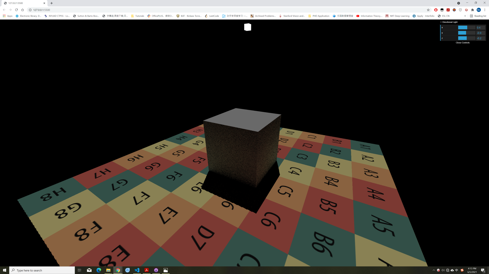
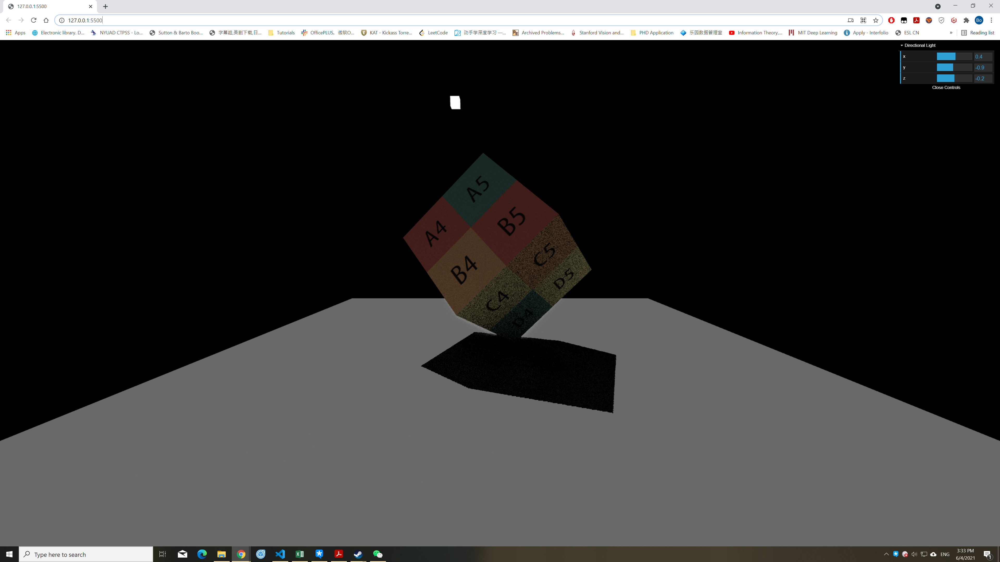

# GAMES202 Homework3

作者: 彭博

## 项目描述
本次作业针对漫反射材质实现了屏幕空间下的全局光照效果，主要内容包括:

- 对场景直接光照的着色(考虑阴影)
- 屏幕空间下光线的求交(SSR)
- 对场景间接光照的着色

## 直接光照

对于漫反射材质的直接光照只需要将BSDF以及入射光的辐照度相乘即可。本次作业中BSDF和入射光辐照度分别由`EvalDiffuse()`以及`EvalDirectionalLight()`两个函数进行计算，代码如下:

```glsl
vec3 EvalDiffuse(vec3 wi, vec3 wo, vec2 uv) {
  vec3 L = vec3(0.0);

  vec3 diffuse = GetGBufferDiffuse(uv);
  vec3 normal = normalize(GetGBufferNormalWorld(uv));

  L = INV_PI * diffuse * max(dot(wi, normal), 0.0);

  return L;
}
```

```glsl
vec3 EvalDirectionalLight(vec2 uv) {
  vec3 Le = vec3(0.0);

  Le = uLightRadiance * GetGBufferuShadow(uv);

  return Le;
}
```

`EvalDiffuse()`函数利用屏幕空间坐标`uv`从`GBuffer`中获取反射率以及法线，将其带入渲染方程得到漫反射材质的BSDF项。需要说明的是漫反射材质为了保证能量守恒需要在最后将反射率除以$\pi$。`EvalDirectionalLight()`函数则利用屏幕空间坐标`uv`从`GBuffer`中获取遮挡信息，将其乘上来自光源的辐照度得到最终所需的入射光辐照度。

完成以上两个函数后进行渲染得到直接光照下的场景如下图：

<div align=center>

</div>

<div align=center>

</div>

<div align=center>

</div>

## Screen Space Ray Tracing (SSR)

接下来实现屏幕空间下的光线求交，这里利用了深度缓存来进行求解，代码如下：

```glsl
bool raymarch(vec3 hitPos, out bool flag) {
  vec2 uv = GetScreenCoordinate(hitPos);

  float depth = GetDepth(hitPos);
  float thre = GetGBufferDepth(uv);

  if (depth > thre) {
    flag = true;
  }

  if(abs(depth - thre) < 1e-2) {
    return true;
  }

  return false;
}

bool RayMarch(vec3 ori, vec3 dir, out vec3 hitPos) {
  float step = 1.0;

  for(int i = 0; i < 100; i++) {
    bool flag = false;
    
    if(step > 100.0) {
      return false;
    }

    hitPos = ori + dir * step;

    if (raymarch(hitPos, flag)) {
      return true;
    }

    if(flag) {
      step = step * 0.5;
    }
    else {
      step = step * 1.5;
    }
  }

  return false;
}
```

`raymarch()`函数用来计算光线与场景是否相交：假设光线前进到`hitPos`位置，利用`GBuffer`获取屏幕空间下`hitPos`对应的深度，如果该深度与`hitPos`自身的深度接近则认为相交并返回`true`，否则返回`false`。此外`raymarch()`函数还设置了`bool`项`flag`来表示光线是否穿过了场景中的物体，利用该项可以实现动态地调节光线前进的步长。

`RayMarch()`函数对应实际的光线求交过程：对于给定的起点`ori`和前进方向`dir`初始化前进步长`step`，此时光线终点`hitPos`为：

$$\text{hitPos}=\text{ori}+\text{step} \cdot \text{dir}$$

然后调用`raymarch()`计算当前光线与场景是否相交，如果相交则返回`true`否则调整步长继续前进。这里使用了动态调节步长的方法：如果`flag`为`true`表示光线已经穿过了物体，因此需要减小步长将步长调整为原来的一半；如果`flag`为`true`表示光线没有穿过任何物体，因此需要增大步长将步长调整为原来的1.5倍。不断迭代以上步骤直至达到迭代步数或步长过大超过场景限制。

## 间接光照

完成光线求交后即可实现场景的间接光照效果。这里使用了蒙特卡洛积分的方式进行求解：首先在上半球采样出一个方向`dir`，然后从`dir`方向出发调用`RayMarch()`函数判断光线与场景是否相交，如果相交的话则计算相应的间接光照否则将间接光照项设为0。间接光照的计算公式为：

$$L_{\text{Indir}} = \frac{1}{pdf} \text{BSDF}(p_0) \cdot [\text{BSDF}(p_1) L_{\text{dir}}(p_1)]$$

其中，$p_0$表示当前着色点，$p_1$表示光线求交后得到的直接光照着色点，$pdf$为积分归一化项。计算间接光照的核心代码如下：

```glsl
// sample a direction
float pdf;
vec3 dir = SampleHemisphereUniform(s, pdf);
// vec3 dir = SampleHemisphereCos(s, pdf);

// local coordinate to world coordinate
dir = R * dir;

// march from current point
bool hit = RayMarch(vPosWorld.xyz, dir, hitPos);

if (hit) {
  vec2 uv1 = GetScreenCoordinate(hitPos);
  L_indir = L_indir + EvalDiffuse(dir, wo, uv) / pdf * EvalDiffuse(wi, -dir, uv1) * EvalDirectionalLight(uv1);
}
```

最后将全部间接光照项求平均即可得到最终的间接光照项，代码可参见`./src/shaders/ssrShader/ssrFragment.glsl`。将间接光照和直接光照相加即可得到最终的全局光照效果，如下图所示：

<div align=center>

</div>

<div align=center>

</div>

<div align=center>

</div>

将全局光照的效果与直接光照进行对比可以发现场景中原来背光的部分被照亮了，这是由于这些着色点接收到了其他着色点反射回来的光从而照亮了原来没有直接被光源照亮的着色点。