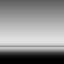

# GAMES202 Homework4

作者: 彭博

## 项目描述

本次作业实现了Kulla-Conty材质模型，主要内容包括:

- 在离线端预计算$E(\mu)$和$E_{avg}$
- 在实时端计算BRDF的能量补偿项

## 预计算$E(\mu)$

首先在离线端完成$E(\mu)$的预计算，根据文档有:

$$
\begin{aligned}
    E(\mu_o) &= \int_{0}^{2\pi} \int_{0}^{1} f_r(\mu_o, \mu_i, \phi) \mu_i d \mu_i d \phi \\
    &= \int_{0}^{2\pi} \int_{0}^{1} \frac{F(i, h) G(i, o, h) D(h)}{4 (h \cdot i) (n \cdot o) } \mu_i d \mu_i d \phi
\end{aligned}
$$

其中, $i$为入射方向，$o$为出射方向，$h$为半程向量，$n$为法向。这里取$F=1.0$，$G$和$D$的计算函数已经给出，只需完成被积函数的计算即可：

```cpp
for (int i = 0; i < sample_count; i++) {
    // TODO: To calculate (fr * ni) / p_o here
    Vec3f L = sampleList.directions[i];
    float pdf= sampleList.PDFs[i];

    float NdotL = std::max(dot(N, L), 0.0f);
    Vec3f H = normalize(L + V);

    float VoH = std::max(dot(V, H), 0.0f);

    float D = DistributionGGX(N, H, roughness);
    float G = GeometrySmith(roughness, NdotV, NdotL);

    // fr = F * D * G / (4 * NdotL * NdotV)
    // E(mu) += fr * NdotL / pdf
    float f = D * G / (4 * NdotV);

     A += f / pdf;
}
```

详细源码可参见`./lut-gen/Emu_MC.cpp`。运行`test.sh`可得到使用蒙特卡洛积分预计算的$E(\mu)$如下图所示：

<div align=center>

</div>

## 预计算$E_{avg}$

完成$E(\mu)$的预计算后可以在它的基础上实现$E_{avg}$的预计算。$E_{avg}$的计算公式如下：

$$
\begin{aligned}
    E_{avg} &= 2 \int_0^1 E(\mu) \mu d \mu
\end{aligned}
$$

其中$E(\mu)$可以直接读取之前的计算结果。这里同样使用蒙特卡洛积分的方式通过对立体角采样来进行计算：

```cpp
for (int i = 0; i < sample_count; i++) {
    Vec3f L = sampleList.directions[i];
    Vec3f H = normalize(V + L);

    float NoL = std::max(L.z, 0.0f);
    float NoH = std::max(H.z, 0.0f);
    float VoH = std::max(dot(V, H), 0.0f);
    float NoV = std::max(dot(N, V), 0.0f);

    // TODO: To calculate Eavg here
    float pdf= sampleList.PDFs[i];
    Eavg += Ei * NoL / (pdf * M_PI);
}
```

需要说明的是我认为这里可以进行简化，无需对立体角进行采样而是对$\mu$采样来计算$E_{avg}$。这里可以把$E_{avg}$看做是$\mu$的函数且$\mu$自身是(0, 1)范围内的变量。在主程序中已经对$\mu$进行了遍历，相当于在(0, 1)范围内进行了均匀采样，因此可以将`main()`函数修改如下：

```cpp
// Eavg += IntegrateEmu(V, roughness, NdotV, Ei) * step;
Eavg += Ei * NdotV * step * 2.0;
```

详细源码可参见`./lut-gen/Eavg_MC.cpp`。运行`test.sh`可得到使用蒙特卡洛积分预计算的$E_{avg}$如下图所示：

<div align=center>

</div>

## Bonus1 重要性采样

使用均匀采样计算得到的$E(\mu)$在粗糙度较低时会产生较大的方差，这里可以使用重要性采样来缓解这个问题。已知待求解的定积分为：

$$
\begin{aligned}
    E(\mu) &= \int_{\Omega} f_r \cos (\theta) d \omega \approx \frac{1}{N} \sum_{k=1}^N \frac{f_r \cdot (n \cdot i)}{p(i)}
\end{aligned}
$$

其中，$p(i)$表示入射方向为$i$对应的概率密度。使用GGX进行采样时对应的概率密度为：

$$
\begin{aligned}
    p(h) = D(h) (h \cdot n)
\end{aligned}
$$

需要说明的是GGX采样得到的是法向$h$而积分变量则是入射方向$i$，因此需要将法向概率密度转换为入射方向概率密度：
$$
\begin{aligned}
    p(i) = \frac{1}{4 (i \cdot h)} p(h)
\end{aligned}
$$

代入每个样本得到求和项为：

$$
\begin{aligned}
    \frac{f_r \cdot (n \cdot i)}{p(i)} = \frac{F(i, h) G(i, o, h) D(h) (n \cdot i)}{4 (n \cdot o) (n \cdot i) p(i)} = \frac{G(i, o, h) (o \cdot h)}{(n \cdot o) (n \cdot h)}
\end{aligned}
$$

只需将每个样本带入上式并取平均即可。代码方面首先实现GGX采样函数`ImportanceSampleGGX()`采样得到法线方向：
```cpp
Vec3f ImportanceSampleGGX(Vec2f Xi, Vec3f N, float roughness) {
    float a = roughness * roughness;

    //TODO: in spherical space - Bonus 1
    float cosTheta = sqrt((1.0f - Xi.y) / (1.0f + (a*a - 1.0f) * Xi.y));
    float sinTheta = sqrt(1.0f - cosTheta * cosTheta);
    float phi = 2.0f * M_PI * Xi.x;

    //TODO: from spherical space to cartesian space - Bonus 1
    Vec3f H;
    H.x = cos(phi) * sinTheta;
    H.y = sin(phi) * sinTheta;
    H.z = cosTheta;

    //TODO: tangent coordinates - Bonus 1
    Vec3f up, T, B;

    up= abs(N.z) < 0.999f ? Vec3f(0.0f, 0.0f, 1.0f) : Vec3f(1.0f, 0.0f, 0.0f);
    T = normalize(cross(up, N));
    B = cross(N, T);

    //TODO: transform H to tangent space - Bonus 1
    H = T * H.x + B * H.y + N * H.z;
    H = normalize(H);
    
    return H;
}
```

然后完成BRDF积分部分：
```cpp
for (int i = 0; i < sample_count; i++) {
    Vec2f Xi = Hammersley(i, sample_count);
    Vec3f H = ImportanceSampleGGX(Xi, N, roughness);
    Vec3f L = normalize(H * 2.0f * dot(V, H) - V);

    float NoL = std::max(L.z, 0.0f);
    float NoH = std::max(H.z, 0.0f);
    float VoH = std::max(dot(V, H), 0.0f);
    float NoV = std::max(dot(N, V), 0.0f);
        
    // TODO: To calculate (fr * ni) / p_o here - Bonus 1
    float G = GeometrySmith(roughness, NoV, NoL);
    float w = G * VoH / (NoH * NoV);

    f += w / sample_count;

    // Split Sum - Bonus 2

}
```

详细源码可参见`./lut-gen/Emu_IS.cpp`。运行`test.sh`可得到使用重要性采样预计算的$E(\mu)$如下图所示：

<div align=center>

</div>

## BRDF补偿

完成预计算部分后可以实现在线端的shader。首先在`PBRFragment.glsl`和`KullaContyFragment.glsl`中补充代码实现PBR材质，相关代码可以参考`./lut-gen/Emu_MC.cpp`中已经给出的实现：

```glsl
float DistributionGGX(vec3 N, vec3 H, float roughness)
{
    // TODO: To calculate GGX NDF here
    float a = roughness*roughness;
    float a2 = a*a;
    float NdotH = SaturateDot(N, H);
    float NdotH2 = NdotH*NdotH;

    float nom   = a2;
    float denom = (NdotH2 * (a2 - 1.0) + 1.0);
    denom = PI * denom * denom;

    return nom / max(denom, 0.0001);
}

float GeometrySchlickGGX(float NdotV, float roughness)
{
    // TODO: To calculate Schlick G1 here
    float a = roughness + 1.0;
    float k = (a * a) / 8.0;

    float nom = NdotV;
    float denom = NdotV * (1.0 - k) + k;

    return nom / denom;
}

float GeometrySmith(vec3 N, vec3 V, vec3 L, float roughness)
{
    // TODO: To calculate Smith G here
    float NoL = SaturateDot(N, L);
    float NoV = SaturateDot(N, V);

    float ggx2 = GeometrySchlickGGX(NoV, roughness);
    float ggx1 = GeometrySchlickGGX(NoL, roughness);

    return ggx1 * ggx2;
}

vec3 fresnelSchlick(vec3 F0, vec3 V, vec3 H)
{
    // TODO: To calculate Schlick F here
    float VoH = SaturateDot(V, H);
    return F0 + (vec3(1.0) - F0) * pow(1.0 - VoH, 5.0);
}
```

然后完成BRDF能量补偿项的计算，计算公式为：

$$
\begin{aligned}
    f_{\text{ms}} (\mu_0, \mu_i) = \frac{(1 - E(\mu_0)) (1 - E(\mu_i))}{\pi (1 - E_{avg})}
\end{aligned}
$$

$$
\begin{aligned}
    f_{\text{add}} (\mu_0, \mu_i) = \frac{F_{avg} E_{avg}}{1 - F_{avg}(1 - E_{avg})}
\end{aligned}
$$

$$
\begin{aligned}
    f_r = f_{\text{micro}} + f_{\text{ms}} \cdot f_{\text{add}}
\end{aligned}
$$

其中$f_{\text{ms}}$为不考虑物体自身颜色情况下的能量补偿，而$f_{\text{add}}$为考虑物体自身颜色对能量吸收的情况下最终反射出能量的比例。二者相乘即为最终的能量补偿项。

在`MultiScatterBRDF()`函数中补充代码如下：
```glsl
vec3 MultiScatterBRDF(float NdotL, float NdotV)
{
    vec3 albedo = pow(texture2D(uAlbedoMap, vTextureCoord).rgb, vec3(2.2));

    vec3 E_o = texture2D(uBRDFLut, vec2(NdotL, uRoughness)).xyz;
    vec3 E_i = texture2D(uBRDFLut, vec2(NdotV, uRoughness)).xyz;

    vec3 E_avg = texture2D(uEavgLut, vec2(0, uRoughness)).xyz;
    // copper
    vec3 edgetint = vec3(0.827, 0.792, 0.678);
    vec3 F_avg = AverageFresnel(albedo, edgetint);
    
    // TODO: To calculate fms and missing energy here
    vec3 F_ms = (vec3(1.0) - E_o) * (vec3(1.0) - E_i) / (PI * (vec3(1.0) - E_avg));
    vec3 F_add= F_avg * E_avg / (vec3(1.0) - F_avg * (vec3(1.0) - E_avg));

    return F_add*F_ms;
}
```

最终得到Kulla-Conty材质和PBR材质的渲染结果如下图所示：

<div align=center>

</div>

## Bonus2 使用Split-Sum预计算$E(\mu)$

根据Schlick近似可以将$E(\mu)$进行分解：

$$
\begin{aligned}
    E(\mu) &= \int_{\Omega} f_r \cos (\theta) d \omega = \int_{\Omega} \frac{f_r}{F} F \cos (\theta) d \omega \\
    &= \int_{\Omega} \frac{f_r}{F} [R_0 + (1 - R_0)(1 - v \cdot h)^5] \cos (\theta) d \omega \\
    &= R_0 \int_{\Omega} \frac{f_r}{F} (1 - (1 - v \cdot h)^5) \cos (\theta) d \omega + \int_{\Omega} \frac{f_r}{F} (1 - v \cdot h)^5 \cos (\theta) d \omega \\
    &= R_0 A + B
\end{aligned}
$$

其中$R_0$为基础反射率，$\mu$为出射方向。上式表明对于任意材质其在$\mu$方向上反射的能量等于基础反射率$R_0$乘以某个常数$A$再加上另一个常数$B$。因此可以预先将常数$A$和$B$写入纹理中，在实际渲染时通过查询纹理来计算所需的$E(\mu)$。

在Split-Sum的基础上，求解渲染方程时可以将光照项分离出来：

$$
\begin{aligned}
    \int_\Omega L_i f_r \cos{(\theta)} d \omega &\approx \frac{1}{N} \sum_{k=1}^N \frac{L_i(l_k) f_r(l_k) \cos{(\theta_{l_k})}}{p(l_k)} \\
    &\approx \Big(\frac{1}{N} \sum_{k=1}^N L_i(l_k) \Big) \Big(\frac{1}{N} \sum_{k=1}^N \frac{f_r(l_k) \cos{(\theta_{l_k})}}{p(l_k)} \Big) \\
    &= \bar{L}_i E(\mu)
\end{aligned}
$$

上式表明任意点的着色可以近似为环境光照的平均值乘以$E(\mu)$。因此可以在离线端对环境光和$E(\mu)$分别进行预计算，实际渲染时直接相乘即可。本次作业中使用的是方向给定的光照，因此在求解渲染方程时无需进行积分，也没有使用到Split-Sum来进行加速。不过在计算BRDF能量补偿项时需要使用$E(\mu)$，这里可以通过Split-Sum来进行计算。

代码方面首先需要修改`Emu_IS.cpp`中BRDF积分的部分，将$A$和$B$分别写入纹理的RG通道：
```cpp
Vec3f IntegrateBRDF(Vec3f V, float roughness) {

    const int sample_count = 1024;
    Vec3f N = Vec3f(0.0, 0.0, 1.0);

    const float R0 = 1.0;
    float f = 0.0;

    float A = 0.0;
    float B = 0.0;

    for (int i = 0; i < sample_count; i++) {
        Vec2f Xi = Hammersley(i, sample_count);
        Vec3f H = ImportanceSampleGGX(Xi, N, roughness);
        Vec3f L = normalize(H * 2.0f * dot(V, H) - V);

        float NoL = std::max(L.z, 0.0f);
        float NoH = std::max(H.z, 0.0f);
        float VoH = std::max(dot(V, H), 0.0f);
        float NoV = std::max(dot(N, V), 0.0f);
        
        // TODO: To calculate (fr * ni) / p_o here - Bonus 1
        float G = GeometrySmith(roughness, NoV, NoL);
        float w = G * VoH / (NoH * NoV);

        // f += w / sample_count;

        // Split Sum - Bonus 2
        float Fc = pow(1.0f - VoH, 5.0);
        A += (1 - Fc) * w / sample_count;
        B += Fc * w / sample_count;
    }

    // return Vec3f(f);
    return Vec3f(A, B, 0.0f);
}
```

得到分离后的$E(\mu)$预计算结果如下：

<div align=center>

</div>

然后在`KullaContyFragment.glsl`中修改$E(\mu_i)$和$E(\mu_o)$的计算。这里取$R_0 = 1.0$，因此对应的$E(\mu)$只需将纹理的RG两通道数值相加即可：

```glsl
vec3 MultiScatterBRDF(float NdotL, float NdotV)
{
    vec3 albedo = pow(texture2D(uAlbedoMap, vTextureCoord).rgb, vec3(2.2));

    vec3 E_o = texture2D(uBRDFLut, vec2(NdotL, uRoughness)).xyz;
    vec3 E_i = texture2D(uBRDFLut, vec2(NdotV, uRoughness)).xyz;

    E_o = vec3(E_o.x + E_o.y);
    E_i = vec3(E_i.x + E_i.y);

    vec3 E_avg = texture2D(uEavgLut, vec2(0, uRoughness)).xyz;

    // copper
    vec3 edgetint = vec3(0.827, 0.792, 0.678);
    vec3 F_avg = AverageFresnel(albedo, edgetint);
    
    // TODO: To calculate fms and missing energy here
    vec3 F_ms = (vec3(1.0) - E_o) * (vec3(1.0) - E_i) / (PI * (vec3(1.0) - E_avg));
    vec3 F_add= F_avg * E_avg / (vec3(1.0) - F_avg * (vec3(1.0) - E_avg));

    return F_add*F_ms;
}
```

实时端的代码可参见`homework4-SplitSum`相应的部分。最终得到材质的渲染结果如下图所示：

<div align=center>

</div>

## Reference
[Real Shading in Unreal Engine 4](https://cdn2.unrealengine.com/Resources/files/2013SiggraphPresentationsNotes-26915738.pdf)