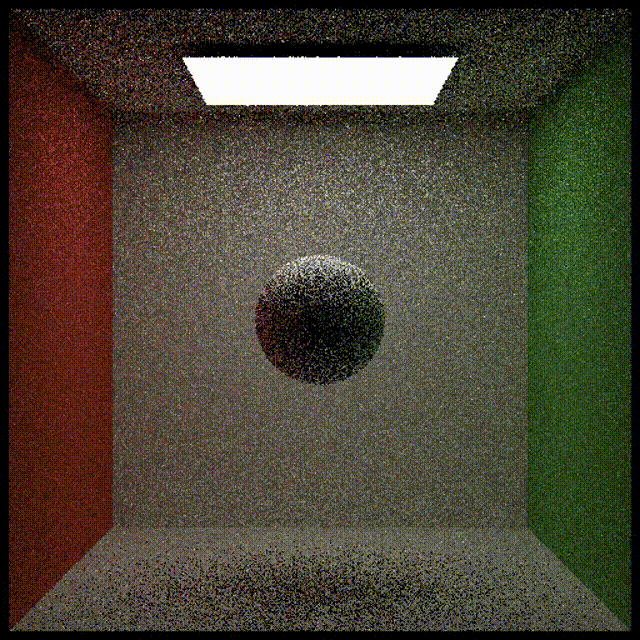

# GAMES202 Homework5

作者: 彭博

## 项目描述

本次作业实现了一个简单的实时光线追踪降噪，主要内容包括:

- 使用联合双边滤波对单帧图像进行降噪
- 利用反向投影累计多帧信息实现图像序列的降噪

## 单帧降噪

针对单帧带噪声的图像使用联合双边滤波进行处理，计算公式如下：

$$
\begin{aligned}
\bar{C}(\mathbf{p}) = \frac{\sum_\mathbf{q} w(\mathbf{q}) \tilde{C}(\mathbf{q})}{\sum_\mathbf{q} w(\mathbf{q})}
\end{aligned}
$$

式中, $\tilde{C}(\mathbf{p})$和$\bar{C}(\mathbf{p})$表示降噪前和降噪后图像在$\mathbf{p}$点的像素值；$w(\mathbf{q})$表示$\mathbf{p}$点邻域内$\mathbf{q}$点对应的权重，可按下式计算:

$$
\begin{aligned}
w(\mathbf{q}) = \exp \{ -\frac{|| \mathbf{p}-\mathbf{q} ||^2}{2 \sigma_p^2} - \frac{|| \tilde{C}(\mathbf{p})-\tilde{C}(\mathbf{q}) ||^2}{2 \sigma_C^2} - \frac{D_N^2(\mathbf{p}, \mathbf{q})}{2 \sigma_N^2} - \frac{D_d^2(\mathbf{p}, \mathbf{q})}{2 \sigma_d^2}  \}
\end{aligned}
$$

$$
\begin{aligned}
D_N(\mathbf{p}, \mathbf{q}) = \arccos (\text{Normal}(\mathbf{p}) \cdot \text{Normal}(\mathbf{q}))
\end{aligned}
$$

$$
\begin{aligned}
D_d(\mathbf{p}, \mathbf{q}) = \text{Normal}(\mathbf{p}) \cdot \frac{\text{Position}(\mathbf{q}) - \text{Position}(\mathbf{p})}{|| \text{Position}(\mathbf{q}) - \text{Position}(\mathbf{p}) ||}
\end{aligned}
$$

$w(\mathbf{q})$通过度量$\mathbf{p}$与$\mathbf{q}$点在图像坐标、颜色、法线方向以及深度差异来确定$\mathbf{q}$点对$\mathbf{p}$点的贡献。联合双边滤波的核心代码如下：

```cpp
for (int y = 0; y < height; y++) {
    for (int x = 0; x < width; x++) {
        // TODO: Joint bilateral filter
        filteredImage(x, y) = frameInfo.m_beauty(x, y);

        // value and weight
        Float3 value_sum(0.0);
        float w, wp, wc, wn, wd;
        float weight_sum= 0.0;

        // filter window
        int x1 = x - kernelRadius;
        int x2 = x + kernelRadius;
        int y1 = y - kernelRadius;
        int y2 = y + kernelRadius;

        if (x1 < 0) x1 = 0;
        if (x2 > width) x2 = width;

        if (y1 < 0) y1 = 0;
        if (y2 > height) y2 = height;

        for (size_t i = x1; i < x2; ++i)
        {
            for (size_t j = y1; j < y2; ++j)
            {
                // weights
                // position weight
                wp = (i-x)*(i-x) + (j-y)*(j-y);
                wp = wp / (2.0*m_sigmaCoord);

                // color weight
                Float3 Ci = frameInfo.m_beauty(x, y);
                Float3 Cj = frameInfo.m_beauty(i, j);

                wc = SqrDistance(Ci, Cj);
                wc = wc / (2.0*m_sigmaColor);

                // normal weight
                Float3 Ni = frameInfo.m_normal(x, y);
                Float3 Nj = frameInfo.m_normal(i, j);

                wn = SafeAcos(Dot(Ni, Nj));
                wn = wn*wn / (2.0*m_sigmaNormal);

                // plane weight
                Float3 Pi = frameInfo.m_position(x, y);
                Float3 Pj = frameInfo.m_position(i, j);
                Float3 dP = Pj - Pi;
                if (Length(dP) > 0.0) dP = Normalize(dP);

                wd = Dot(Ni, dP);
                wd = wd*wd / (2.0*m_sigmaPlane);

                w = wp + wc + wn + wd;
                w = exp(-w);

                Float3 v = frameInfo.m_beauty(i, j);
                value_sum += v * w;
                weight_sum+= w;

            }
        }
        
        filteredImage(x, y) = value_sum / weight_sum;
    }
}
```

详细源码参见`./src/denoiser.cpp`中`Denoiser::Filter()`函数。对`box`和`pink-room`两个场景进行滤波可得到降噪前后的图像对比如下：

<div align=center>


</div>

<div align=center>


</div>

## 反向投影

获得单帧降噪图像后需要将其投影到前一帧图像中寻找对应，对应点像素坐标计算公式如下：

$$
\begin{aligned}
s_{i-1} = P_{i-1} V_{i-1} M_{i-1} M_i^{-1} s_i
\end{aligned}
$$

详细源码可参见`./src/denoiser.cpp`中`Denoiser::Reprojection()`函数。

```cpp
for (int y = 0; y < height; y++) {
    for (int x = 0; x < width; x++) {
        // TODO: Reproject
        m_valid(x, y) = false;
        m_misc(x, y) = m_accColor(x, y);

        // back projection
        int curID = frameInfo.m_id(x, y);
        Float3 p = frameInfo.m_position(x, y);

        if (curID != -1) {
            Matrix4x4 M_cur_inv = Inverse(frameInfo.m_matrix[curID]);
            Matrix4x4 M_pre = m_preFrameInfo.m_matrix[curID];
            Matrix4x4 P = preWorldToScreen * M_pre * M_cur_inv;

            p = P(p, Float3::Point);

            p.x /= p.z;
            p.y /= p.z;

            // validation check
            if (p.x >= 0 && p.x < width && p.y >= 0 && p.y < height) {
                // find ID in the previous frame
                int i = static_cast<int>(p.x);
                int j = static_cast<int>(p.y);
                int preID = m_preFrameInfo.m_id(i, j);

                if (curID == preID) {
                    m_valid(x, y) = true;
                    m_misc(x, y) = m_accColor(i, j);
                }
            }
        }
    }
}
```

## 累积多帧信息

获得当前图像中每一像素点在前一帧的对应后即可利用指数滑动平均的方法在图像序列上进行滤波，计算公式如下:

$$
\bar{C}_i(\mathbf{p}) \leftarrow \alpha \bar{C}_i(\mathbf{p}) + (1 - \alpha) \bar{C}_{i-1}(\mathbf{p})
$$

式中，$\alpha$为衰减权重。若$\mathbf{p}$点在上一帧中存在对应则取一较小值（本次作业中取0.2）；否则取1.0表示此时只考虑当前帧的滤波结果。对应代码如下：

```cpp
for (int y = 0; y < height; y++) {
    for (int x = 0; x < width; x++) {
        // TODO: Temporal clamp
        Float3 color = m_accColor(x, y);
        Float3 mu, sig;

        // filter window
        int x1 = x - kernelRadius;
        int x2 = x + kernelRadius;
        int y1 = y - kernelRadius;
        int y2 = y + kernelRadius;

        if (x1 < 0) x1 = 0;
        if (x2 > width) x2 = width;

        if (y1 < 0) y1 = 0;
        if (y2 > height) y2 = height;

        int n = 0;
        for (size_t i = x1; i < x2; ++i)
        {
            for (size_t j = y1; j < y2; ++j)
            {
                mu += m_accColor(i, j);
                ++n;
            }
        }

        // mean and std
        mu = mu / n;

        for (size_t i = x1; i < x2; ++i)
        {
            for (size_t j = y1; j < y2; ++j)
            {
                sig += Sqr(m_accColor(i, j) - mu);
            }
        }

        sig = sig / (n-1);
        sig = SafeSqrt(sig);

        color = Clamp(color, mu-sig*m_colorBoxK, mu+sig*m_colorBoxK);

        // TODO: Exponential moving average
        float alpha = 1.0;
        if (m_valid(x, y)) alpha = m_alpha;

        m_misc(x, y) = Lerp(color, curFilteredColor(x, y), alpha);
    }
}
```

详细源码参见`./src/denoiser.cpp`中`Denoiser::TemporalAccumulation()`函数。将以上三步结合起来即可实现对实时光线追踪的降噪，降噪前后的对比如下：

<div align=center>


</div>

<div align=center>


</div>

## Bonus1 À-Trous Wavelet 单帧降噪加速

在进行单帧图像降噪时为了保证降噪的效果往往需要使用一个较大的卷积核，如本次作业中使用的是(32, 32)大小的核。在这样的情况下滤波会变得非常缓慢，难以满足实时的要求，因此需要考虑对单帧滤波进行加速。这里使用了À-Trous Wavelet的加速方法，其思想是把一个大的卷积核分解成若干个级联的小卷积核，在每次进行卷积时对核进行扩张从而近似原始的卷积。À-Trous Wavelet的示意图如下：

<div align=center>

</div>

在本次作业中使用了3个级联的(5, 5)大小的卷积核来近似原始的(32, 32)卷积核。相应的代码和滤波结果如下：

```cpp
// À-Trous Wavelet
int levels = 3;
int h = 1;
kernelRadius = 2;

// initialize cache
Buffer2D<Float3> cachedImage = CreateBuffer2D<Float3>(width, height);
cachedImage.Copy(frameInfo.m_beauty);

for (size_t l = 0; l < levels; l++)
{
    #pragma omp parallel for
    for (int y = 0; y < height; y++) {
        for (int x = 0; x < width; x++) {
            // value and weight
            Float3 value_sum(0.0);
            float w, wp, wc, wn, wd;
            float weight_sum= 0.0;

            // filter on current level
            for (int i = -kernelRadius; i <= kernelRadius; ++i)
            {
                for (int j = -kernelRadius; j <= kernelRadius; ++j) {
                    int xx = x + h * i;
                    int yy = y + h * j;

                    if (xx < 0 || xx >= width || yy < 0 || yy >= height) continue;

                    // weights
                    // position weight
                    wp = (xx-x)*(xx-x) + (yy-y)*(yy-y);
                    wp = wp / (2.0*m_sigmaCoord);

                    // color weight
                    Float3 Ci = cachedImage(x, y);
                    Float3 Cj = cachedImage(xx, yy);

                    wc = SqrDistance(Ci, Cj);
                    wc = wc / (2.0*m_sigmaColor);

                    // normal weight
                    Float3 Ni = frameInfo.m_normal(x, y);
                    Float3 Nj = frameInfo.m_normal(xx, yy);

                    wn = SafeAcos(Dot(Ni, Nj));
                    wn = wn*wn / (2.0*m_sigmaNormal);

                    // plane weight
                    Float3 Pi = frameInfo.m_position(x, y);
                    Float3 Pj = frameInfo.m_position(xx, yy);
                    Float3 dP = Pj - Pi;
                    if (Length(dP) > 0.0) dP = Normalize(dP);

                    wd = Dot(Ni, dP);
                    wd = wd*wd / (2.0*m_sigmaPlane);
                    
                    w = wp + wc + wn + wd;
                    w = exp(-w);

                    Float3 v = cachedImage(xx, yy);
                    value_sum += v * w;
                    weight_sum+= w;
                }
            }

            filteredImage(x, y) = value_sum / weight_sum;
        }
    }

    // update step length
    h *= 2;

    // update cache
    cachedImage.Copy(filteredImage);
}
```

<div align=center>


</div>

<div align=center>


</div>

不难发现使用À-Trous算法可以达到类似于直接使用大卷积核的效果。由于每个小卷积核进行滤波的计算代价都远小于大卷积核，因此À-Trous算法可以极大地加速单帧图像的滤波降噪过程。

# Reference

[Edge-avoiding À-Trous wavelet transform for fast global illumination filtering](https://jo.dreggn.org/home/2010_atrous.pdf)